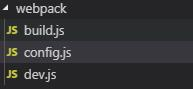

# 区分不同环境和环境变量

模块化开发过程中，我们一般需要区分生产环境和开发环境的代码，以便于我们的数据调试和代码代码调试

**环境区分：**

_我们可以把weboack.config.js 分成多个引入文件，开不同开发环境阶段引入不同文件，_

例如下图:



我把所有配置分为三个文件，当处于开发模式下执行：webpack-dev-server --config webpack/dev.js    运行开发模式下的配置  ，

当处于生产阶段，执行:webpack --config webpack/build.js 运行开发模式下的配置，可以将不同模式的配置写在对应的文件下面，以区分不同环境；

**先看config 公共配置文件**

```javascript
const path = require('path')
const HtmlWebpackPlugin = require('html-webpack-plugin')
const MiniCssExtractPlugin = require('mini-css-extract-plugin')
const glob = require('glob')
const htmlChunk = []
const entryArry = {}
var htmlPlugins = []
    // const webpack = require('webpack')

const getEntry = function() {
    var p = './src/path/*'
    var files = glob.sync('./src/path/*');
    var filesName = glob.sync(p + '/index.js');

    files.map((item, key) => {
        files[key] = item.replace('./src/path/', '').toString()
        entryArry[files[key]] = filesName[key]
        htmlChunk.push(files[key])
        htmlPlugins.push(new HtmlWebpackPlugin({ // 打包生成html文件并自动引入对应的资源文件
            filename: files[key] + '/index.html', //生成的文件名 默认index.html
            // filename: files[key] + '/index.html', //生成的文件名 默认index.html
            template: './src/index.html', //生成文件的模板
            chunks: [files[key]],
        }))
    });
}
getEntry()
module.exports = {
    // entry: './src/path/index/index.js',
    entry: entryArry,
    output: {
        path: path.resolve(__dirname, '../dist'),
        filename: '[name]/[name].[hash].js'
    },
    stats: { children: false },
    module: {
        rules: [{
                test: /\.vue$/,
                use: 'vue-loader'
            }, {
                test: /\.css$/,
                use: [
                    MiniCssExtractPlugin.loader, 'css-loader',
                ],
            },
            {
                test: /\.js$/,
                exclude: /(node_modules|bower_components)/,
                use: {
                    loader: 'babel-loader',
                    options: {
                        presets: ['@babel/preset-env']
                    }
                }
            }
        ]
    },
    plugins: [
        ...htmlPlugins,
        new MiniCssExtractPlugin({
            filename: '[name]/index.css' // 分类生成css对应文件
        }),
       new webpack.DefinePlugin({
            DEV: JSON.stringify('dev') //环境变量
        })

    ]
}
```

**开发模式**   dev.js

```javascript
const merge = require('webpack-merge')
const option = require('./config')
const webpack = require('webpack')
const path = require('path')
module.exports = merge(option, {
    mode: 'development',
    devServer: {
        port: 4000,
        host: 'localhost',
        // contentBase: path.resolve(__filename, '../dist/index'),
        contentBase: './dist/index1',
        open: true,
    },
    plugins: [
        new webpack.DefinePlugin({
            DEV: JSON.stringify('dev')
        })
    ]
})
```

**生产模式**  build.js

```javascript
const merge = require('webpack-merge')
const option = require('./config')
const { CleanWebpackPlugin } = require('clean-webpack-plugin')
module.exports = merge(option, {
    mode: 'production',
    plugins: [
        new CleanWebpackPlugin()
    ]
})
```

**环境变量**

DefinePlugin  weboack自带的插件

\*\*\*\*

```javascript
plugins: [
    new webpack.DefinePlugin({
        DEV: JSON.stringify('dev') // 将DEV暴露为全局值为字符串‘dev’
    })
    
```

