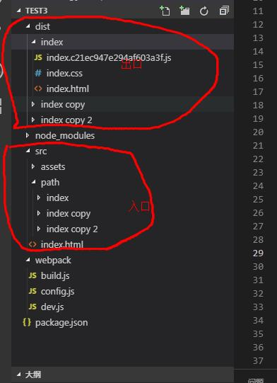

# 跨域、source-map，多页应用打包、

**跨域**

前后端分离，在前段服务于后端服务进行接口交互的时候，会出现跨域现象

```javascript
   devServer: {
        port: 3000,
        open: true,
        contentBase: './webpack/dist/index.html',
        host: 'localhost',
        hot: true,
        proxy: { // webpack-dev-server 的该属性可以进行代理
            '/api': "http://localhost:8080" // 代理地址，跨域
        }
    },
```

**source-map**

source-map 可以在开发的过程当中映射你的源码，而非你被webpack编译后的代码，方便调试。

```javascript
npm i -D source-map-loader

devtool: "source-map", 

{
                test: /\.js$/,
                use: ["source-map-loader", {
                    loader: 'babel-loader',
                    options: {
                        presets: ['@babel/preset-env'],
                    }
                }],
                enforce: "pre"
            },

```

**多页应用打包**

有时候我们需要对项目根据不同功能来打包成独立的功能项目，此时我们可以用到该方法

​

```javascript
const path = require('path')
const HtmlWebpackPlugin = require('html-webpack-plugin')
const MiniCssExtractPlugin = require('mini-css-extract-plugin')
const glob = require('glob')
const entryArry = {}//多入口文件
var htmlPlugins = []//多出口插入html模板
const getEntry = function() {
    var files = glob.sync('./src/path/*'); //获取指定文件下面的所有直接文件
    var filesName = glob.sync('./src/path/*/index.js');//获取指定文件下面的index.js文件
    files.map((item, key) => {
        files[key] = item.replace('./src/path/', '').toString()
        entryArry[files[key]] = filesName[key]
        htmlPlugins.push(new HtmlWebpackPlugin({ // 打包生成html文件并自动引入对应的资源文件
            filename: files[key] + '/index.html', //生成的文件名 默认index.html
            template: './src/index.html', //生成文件的模板,
            chunks:[ files[key]] // 根据不同入口，引入不同的js
        }))
    });
}
getEntry()
module.exports = {
    // entry: './src/path/index/index.js', //单入口
    entry: entryArry,//多入口
    output: {
        path: path.resolve(__dirname, '../dist'),
        filename: '[name]/[name].[hash].js'//根据不同的文件名生成对应的文件夹
    },
    stats: { children: false },
    module: {
        rules: [{
                test: /\.vue$/,
                use: 'vue-loader'
            }, {
                test: /\.css$/,
                use: [
                    MiniCssExtractPlugin.loader, 'css-loader',
                ],
            },
            {
                test: /\.js$/,
                exclude: /(node_modules|bower_components)/,
                use: {
                    loader: 'babel-loader',
                    options: {
                        presets: ['@babel/preset-env']
                    }
                }
            }
        ]
    },
    plugins: [
        ...htmlPlugins,
        new MiniCssExtractPlugin({
            filename: '[name]/index.css' // 分类生成css对应文件
        }),
        // new HtmlWebpackPlugin({ // 打包生成html文件并自动引入对应的资源文件
        //     filename: "index.html", //生成的文件名 默认index.html
        //     template: './src/index.html', //生成文件的模板
        //     chunks: htmlChunk
        // })
    ]
}
```




